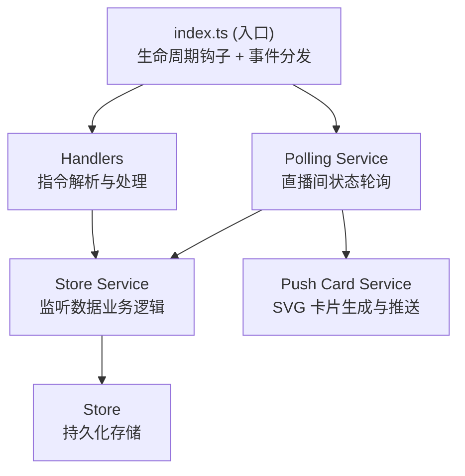

# Bilibili 监测者

一个 NapCat 插件，监听 Bilibili 直播间状态与主播动态并推送到指定会话：开播/下播、直播中与未直播时的标题/分区变化、动态发布（含图文/转发/视频/文章/表情包等类型），推送内容为渲染好的 SVG 卡片图片（失败时回退纯文本）。

## 功能

- **直播间状态轮询**：按配置间隔批量拉取监听中主播的直播间状态（B 站 `getStatusInfoByUids` 批量接口）
- **变化检测与推送**：
  - `start_stream` 开始直播（附带直播间封面图）
  - `end_stream` 结束直播
  - `restart_stream` 重新开播（直播中检测到 `live_time` 变化且在 5 分钟窗口内：先推送一次上一场结束信息，再推送重新开播卡片；超过窗口视为未观测到的完整直播，静默清理旧场数据不推送）
  - `title_changed` / `area_changed` 直播中修改标题/分区
  - `offline_title_changed` / `offline_area_changed` 未直播时修改标题/分区（独立推送类型，可单独关闭）
- **动态监听与推送**：轮询监听主播的空间动态，支持图文/转发/视频/转发视频/文章/直播开播等动态类型解析；表情包以图片内嵌文本原位置替换
- **B 站账号登录**：私聊扫码登录（二维码自动刷新），登录后可使用动态监听；WebUI 配置面板展示登录状态
- **SVG 卡片推送**：直播/动态变化以图片卡片形式推送，封面右上角带直播/未直播状态角标，时间显示为事件发生时间（开播推送为开播时间）；渲染失败自动回退纯文本
- **开播 @ 订阅**：可为单个主播订阅开播 @ 提醒
- **监听上限管理**：每个会话有监听主播数量上限（直播与动态独立计数），超级管理员可查看/调整
- **推送类型可配置**：WebUI 配置面板中按类型勾选需要推送的变化

## 指令

默认指令前缀为 `#bili`（可在配置中修改 `commandPrefix`）：

### 直播监听

| 指令 | 说明 |
|------|------|
| `#bili live add <主播uid>` | 添加主播监听 |
| `#bili live remove <主播uid>` | 移除主播监听 |
| `#bili live list` | 查看当前监听的主播列表 |
| `#bili live mention <主播uid>` | 订阅主播开播 @ 提醒（仅群聊） |
| `#bili live unmention <主播uid>` | 取消订阅开播 @ 提醒（仅群聊） |
| `#bili live help` | 查看指令帮助 |

### 动态监听

| 指令 | 说明 |
|------|------|
| `#bili dyn add <主播uid>` | 添加主播到动态监听列表 |
| `#bili dyn remove <主播uid>` | 从动态监听列表移除主播 |
| `#bili dyn latest <主播uid>` | 查看主播最新一条动态 |
| `#bili dyn list` | 查看当前监听动态的主播列表 |
| `#bili dyn help` | 查看动态监听指令帮助 |

### 账号管理（仅私聊，超级管理员）

| 指令 | 说明 |
|------|------|
| `#bili user login` | 扫码登录 Bilibili 账号 |
| `#bili user logout` | 登出 Bilibili 账号 |
| `#bili user status` | 查询当前登录状态 |
| `#bili user help` | 查看账号管理指令帮助 |

### 监听上限（仅超级管理员）

超级管理员在配置项 `adminUsers` 中配置（逗号分隔的 QQ 号列表，运行期以数组形式可用）。`live max` 与 `dyn max` 形态一致：

| 指令 | 说明 |
|------|------|
| `#bili live max` / `#bili dyn max` | 查看当前会话监听上限（群管理员也可用） |
| `#bili live max <监听数>` / `#bili dyn max <监听数>` | 设置当前群监听上限（群聊） |
| `#bili live max <监听数> <group\|private> <id>` / `#bili dyn max ...` | 修改指定会话监听上限（私聊） |

## 配置

| 配置项 | 说明 | 默认值 |
|--------|------|--------|
| `enabled` | 插件全局开关 | `true` |
| `debug` | 调试模式，输出详细日志 | `false` |
| `commandPrefix` | 指令前缀 | `#bili` |
| `pollIntervalSeconds` | 直播状态轮询间隔（秒） | `60` |
| `dynPollIntervalSeconds` | 动态轮询间隔（秒） | `300` |
| `pushTypes` | 需要推送的变化类型（多选） | 全部类型 |
| `adminUsers` | 超级管理员 QQ 号（逗号分隔，WebUI 输入；运行期为数组） | 空 |

配置可在 NapCat WebUI 插件配置面板中修改。

## 项目结构

```
napcat-plugin-bilibili-monitor/
├── src/
│   ├── index.ts                          # 插件入口，生命周期函数
│   ├── config.ts                         # 默认配置与 WebUI 配置 Schema
│   ├── types.ts                          # 类型定义
│   ├── core/
│   │   ├── state.ts                      # 全局状态管理单例
│   │   └── admin.ts                      # 超级管理员判断
│   ├── api/
│   │   ├── baseRequest.ts                # B 站 API 请求封装（authRequest 携带 Cookie）
│   │   ├── getStatusInfoByUids.ts    # 批量查询直播间状态
│   │   ├── getDynamicFeed.ts         # 拉取用户空间动态
│   │   ├── getNavInfo.ts             # 登录状态/用户信息查询
│   │   └── qrcodeLogin.ts            # 扫码登录接口
│   ├── handlers/
│   │   ├── message.handler.ts            # 消息处理（解析、CD 冷却、发送工具）
│   │   ├── instruction.handler.ts        # 指令分发（权限/作用域校验）
│   │   ├── live/                         # live 子指令 handlers
│   │   ├── dyn/                          # dyn 子指令 handlers
│   │   └── user/                         # user 子指令 handlers（登录/登出/状态）
│   ├── services/
│   │   ├── live/polling.service.ts  # 直播状态轮询服务
│   │   ├── live/store.service.ts    # 直播监听数据业务逻辑
│   │   ├── dyn/polling.service.ts # 动态轮询服务
│   │   ├── dyn/store.service.ts # 动态监听数据业务逻辑
│   │   ├── dyn/parser.service.ts         # 动态解析（纯函数，多动态类型模板）
│   │   ├── dyn/push.service.ts           # 动态推送服务
│   │   ├── user/login.service.ts              # 扫码登录会话管理
│   │   ├── live/limit.service.ts / dyn/limit.service.ts # 监听上限管理
│   │   ├── live/pushCard.service.ts     # 直播推送卡片生成与发送
│   │   ├── svgRender.service.ts         # SVG 渲染图片服务
│   │   └── api.service.ts                # WebUI API 路由
│   ├── store/                            # 持久化存储层
│   │   ├── BaseStore.ts
│   │   ├── biliLive.store.ts            # 直播监听主播列表
│   │   ├── biliLiveRoom.store.ts       # 直播间状态与变化检测
│   │   ├── biliLiveLimit.store.ts      # 直播监听上限
│   │   ├── biliDynamic.store.ts         # 动态监听主播列表
│   │   ├── biliDynLimit.store.ts       # 动态监听上限
│   │   └── biliCookie.store.ts          # 登录 Cookie 存储
│   ├── utils/
│   │   ├── format.ts                     # 格式化工具
│   │   └── helpMessage.ts               # 帮助消息输出（按角色+会话类型选版本）
│   ├── assets/                           # 帮助图片资源
│   └── webui/                            # React SPA 前端（独立构建）
└── docs/                                 # store/help 范式文档与 ADR
```

## 快速开始

### 安装

从 GitHub Release 下载 zip 包，解压到 NapCat 的 `plugins` 目录，或通过插件索引安装。

### 开发

```bash
pnpm install

# 完整构建（后端 + WebUI 前端 + 资源复制）
pnpm run build

# 仅构建 WebUI 前端
pnpm run build:webui

# WebUI 前端开发服务器
pnpm run dev:webui

# 类型检查
pnpm run typecheck
```

### 调试 & 热重载

通过 Vite 插件 `napcatHmrPlugin` 集成热重载（已在 `vite.config.ts` 配置），需要在 NapCat 端安装 `napcat-plugin-debug` 插件并启用，通过 `.env` 中的 `WS_URL` 与 `TOKEN` 连接远程 NapCat 实例：

```bash
# watch 构建 + 每次构建后自动部署 + 热重载
pnpm run watch
```

> 只开发 WebUI 前端时推荐 `pnpm run dev:webui`。

## 架构说明

### 分层架构



### 核心设计

| 设计 | 实现位置 | 说明 |
|------|----------|------|
| 单例状态 | `src/core/state.ts` | `pluginState` 全局单例，持有 ctx、config、logger |
| 存储分层 | `src/store/*.ts` | `BaseStore` 基类 + 各数据存储，单例模式惰性获取 |
| 变化检测 | `src/store/biliLiveRoom.store.ts` | 轮询比对直播间状态，产出 `ChangeType` 事件 |
| 动态解析 | `src/services/dyn/parser.service.ts` | 纯函数模块，解析各类动态为渲染所需结构 |
| 推送渲染 | `src/services/live/pushCard.service.ts` | SVG 卡片渲染，失败回退纯文本 |

架构决策记录见 [docs/adr](docs/adr/)。

## CI/CD 自动发布

推送 `v*` 格式的 tag 即可自动构建并创建 GitHub Release：

```bash
git tag v1.0.0
git push origin v1.0.0
```

Release 发布后会自动向 [napcat-plugin-index](https://github.com/NapNeko/napcat-plugin-index) 提交 PR 更新插件索引。

## 许可证

MIT License
