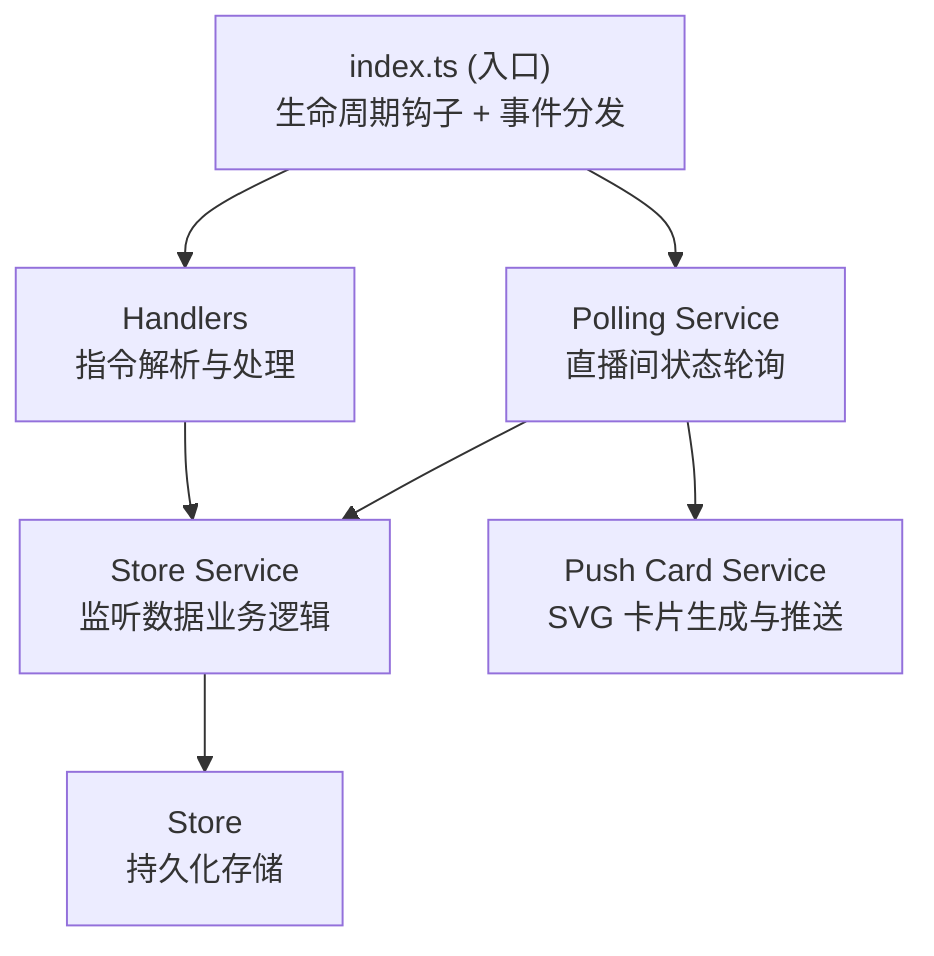

# Bilibili 监测者

一个 NapCat 插件，监听 Bilibili 直播间状态并推送到指定会话：开播/下播、直播中与未直播时的标题/分区变化，推送内容为渲染好的 SVG 卡片图片（失败时回退纯文本）。

## 功能

- **直播间状态轮询**：按配置间隔批量拉取监听中主播的直播间状态（B 站 `getStatusInfoByUids` 批量接口）
- **变化检测与推送**：
  - `start_stream` 开始直播（附带直播间封面图）
  - `end_stream` 结束直播
  - `title_changed` / `area_changed` 直播中修改标题/分区
  - `offline_title_changed` / `offline_area_changed` 未直播时修改标题/分区（独立推送类型，可单独关闭）
- **SVG 卡片推送**：直播变化以图片卡片形式推送，封面右上角带直播/未直播状态角标，时间显示为事件发生时间（开播推送为开播时间）；渲染失败自动回退纯文本
- **开播 @ 订阅**：可为单个主播订阅开播 @ 提醒
- **监听上限管理**：每个会话有监听主播数量上限，超级管理员可查看/调整
- **推送类型可配置**：WebUI 配置面板中按类型勾选需要推送的变化

> 用户动态发布、视频发布监听开发中，敬请期待。

## 指令

默认指令前缀为 `#bili`（可在配置中修改 `commandPrefix`）：

| 指令 | 说明 |
|------|------|
| `#bili live add <主播uid>` | 添加主播监听 |
| `#bili live remove <主播uid>` | 移除主播监听 |
| `#bili live list` | 查看当前监听的主播列表 |
| `#bili live mention <主播uid>` | 订阅主播开播 @ 提醒 |
| `#bili live unmention <主播uid>` | 取消订阅开播 @ 提醒 |
| `#bili live help` | 查看指令帮助 |

### 管理员指令（仅超级管理员）

超级管理员在配置项 `adminUser` 中配置（逗号分隔的 QQ 号列表）：

| 指令 | 说明 |
|------|------|
| `#bili live max` | 查看当前会话监听上限 |
| `#bili live max <监听数>` | 设置当前群监听上限（群聊） |
| `#bili live max <监听数> <group\|private> <id>` | 修改指定会话监听上限（私聊） |

## 配置

| 配置项 | 说明 | 默认值 |
|--------|------|--------|
| `enabled` | 插件全局开关 | `true` |
| `debug` | 调试模式，输出详细日志 | `false` |
| `commandPrefix` | 指令前缀 | `#bili` |
| `cooldownSeconds` | 同一命令冷却时间（秒），0 不限制 | `0` |
| `pollIntervalSeconds` | 直播状态轮询间隔（秒） | `60` |
| `pushTypes` | 需要推送的变化类型（多选） | 全部类型 |
| `adminUser` | 超级管理员 QQ 号（逗号分隔） | 空 |

配置可在 NapCat WebUI 插件配置面板中修改。

## 项目结构

```
napcat-plugin-bilibili-monitor/
├── src/
│   ├── index.ts                          # 插件入口，生命周期函数
│   ├── config.ts                         # 默认配置与 WebUI 配置 Schema
│   ├── types.ts                          # 类型定义
│   ├── core/
│   │   ├── state.ts                      # 全局状态管理单例
│   │   └── admin.ts                      # 超级管理员判断
│   ├── api/
│   │   ├── baseRequest.ts                # B 站 API 请求封装
│   │   └── api_getStatusInfoByUids.ts    # 批量查询直播间状态
│   ├── handlers/
│   │   ├── message.handler.ts            # 消息处理（解析、CD 冷却、发送工具）
│   │   ├── instruction.handler.ts        # 指令分发
│   │   └── live/                         # live 子指令 handlers
│   │       ├── add-live.handler.ts
│   │       ├── remove-live.handler.ts
│   │       ├── list-live.handler.ts
│   │       ├── mention-live.handler.ts
│   │       ├── unmention-live.handler.ts
│   │       ├── max-live.handler.ts
│   │       └── help-live.handler.ts
│   ├── services/
│   │   ├── bili-live-polling.service.ts  # 直播状态轮询服务
│   │   ├── bili-live-store.service.ts    # 监听数据业务逻辑
│   │   ├── live-limit.service.ts         # 监听上限管理
│   │   ├── live-push-card.service.ts     # 推送卡片生成与发送
│   │   ├── svg-render-service.ts         # SVG 渲染图片服务
│   │   └── api.service.ts                # WebUI API 路由
│   ├── store/                            # 持久化存储层
│   │   ├── BaseStore.ts
│   │   ├── bili-live.store.ts            # 监听主播列表
│   │   ├── bili-live-room.store.ts       # 直播间状态与变化检测
│   │   └── bili-live-limit.store.ts      # 会话监听上限
│   ├── utils/
│   │   └── format.ts
│   └── webui/                            # React SPA 前端（独立构建）
└── docs/adr/                             # 架构决策记录
```

## 快速开始

### 安装

从 GitHub Release 下载 zip 包，解压到 NapCat 的 `plugins` 目录，或通过插件索引安装。

### 开发

```bash
pnpm install

# 完整构建（后端 + WebUI 前端 + 资源复制）
pnpm run build

# 仅构建 WebUI 前端
pnpm run build:webui

# WebUI 前端开发服务器
pnpm run dev:webui

# 类型检查
pnpm run typecheck
```

### 调试 & 热重载

通过 Vite 插件 `napcatHmrPlugin` 集成热重载（已在 `vite.config.ts` 配置），需要在 NapCat 端安装 `napcat-plugin-debug` 插件并启用：

```bash
# 一键部署：构建 → 自动复制到远程插件目录 → 自动重载
pnpm run deploy

# 开发模式：watch 构建 + 每次构建后自动部署 + 热重载
pnpm run dev
```

> `pnpm run dev` 仅监听插件后端（`src/` 下非 webui 文件）的变化。只开发 WebUI 前端时推荐 `pnpm run dev:webui`。

## 架构说明

### 分层架构



### 核心设计

| 设计 | 实现位置 | 说明 |
|------|----------|------|
| 单例状态 | `src/core/state.ts` | `pluginState` 全局单例，持有 ctx、config、logger |
| 存储分层 | `src/store/*.ts` | `BaseStore` 基类 + 各数据存储，单例模式获取 |
| 变化检测 | `src/store/bili-live-room.store.ts` | 轮询比对直播间状态，产出 `ChangeType` 事件 |
| 推送渲染 | `src/services/live-push-card.service.ts` | SVG 卡片渲染，失败回退纯文本 |

架构决策记录见 [docs/adr](docs/adr/)。

## CI/CD 自动发布

推送 `v*` 格式的 tag 即可自动构建并创建 GitHub Release：

```bash
git tag v1.0.0
git push origin v1.0.0
```

Release 发布后会自动向 [napcat-plugin-index](https://github.com/NapNeko/napcat-plugin-index) 提交 PR 更新插件索引。

## 许可证

MIT License
